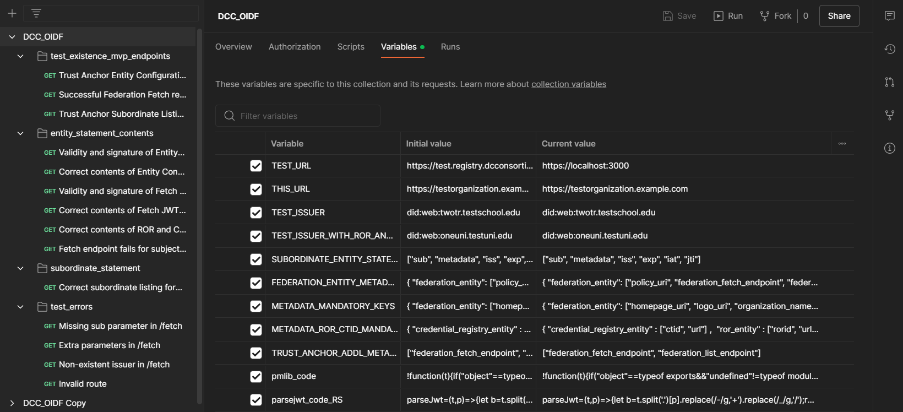
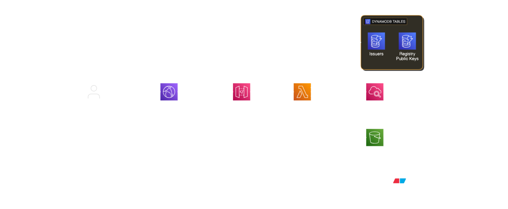

# dcc-members-oidf

## Description:

A pilot implementation of an issuer identity registry for learning and employment credentials, using a version of the [OpenID Federation](https://openid.net/specs/openid-federation-1_0.html) specification.


## Dependencies:

sqlite3, express, jose, terraform, [pmlib](https://joolfe.github.io/postman-util-lib/)

## Install/setup

Install Terraform (https://developer.hashicorp.com/terraform/tutorials/aws-get-started/install-cli)

Then run  `aws configure` or `aws configure sso` and log in to your AWS account which is connected to the installation. If you need to set up an access key (for aws configure), you can do so at https://us-east-1.console.aws.amazon.com/iam/home?region=us-east-1#/security_credentials?section=IAM_credentials, and then click "Create access key". Then fill it in after running `aws configure`:

```
AWS Access Key ID: YOUR_ACCESS_KEY
AWS Secret Access Key: YOUR_SECRET_ACCESS_KEY
Default region name [None]: us-east-1
Default output format [None]: 
```

If it's your first time ever deploying a registry to your AWS environment, run `terraform init`. Let terraform  set up the modules. Running `terraform plan` or `terraform apply` should indicate that about 45 new components are ready to deploy on AWS.


# If it's your first time deploying a registry to your AWS environment

Run `terraform apply` 

Set up your DNS records:

Using `terraform output`, add to your DNS records:
- First: certificate_validation_cname and subdomain_validation_cname
- Next: api_gateway_cname

General note about deployment:
- For the first deployment of the cloudwatch distributions, the deployment might fail on the first time, then it might actually be deployed and the import will need to happen manually (`terraform import`)


# If you are connecting to an already deployed cloud instance

Check to see if your account has access to the currently deployed registry (you can run a check like `aws lambda get-function --function-name dcc-oidf-t-issuer-registry --region us-east-1` which will try to get a status of the lambda deployment). If this status check works, load a terraform.tfstate file in the main directory of the repo which is shared with you, then run `terraform plan`. You should have 2 or 4 components ready to redeploy (code zips and potentially lambda functions). You can use `terraform apply` to redeploy code to AWS: however you should try to work with test and prod separately.

Push new code to test only: `terraform apply "-target=module.test"`
Push new code to prod only: `terraform apply "-target=module.production"`
(Rarely used): push new SSL certs: `terraform apply "-target=module.certificates"` 
(Do not use unless you want to update test and prod simultaneously): `terraform apply "-target=module.certificates"`


# Editing source code

In `./lambda_function`. Run locally (SQLite) or push to AWS. (`npm run builddb`, `npm run localtestdata`, `npm run webservice`)


# Editing rows in tables in an already deployed cloud instance

All values are strings (TEXT). See `./schema.sql` for the columns which are used in each table (issuers and registry info) and `./testdata.sql` for sample data. If you need to fill a database from scratch, you can use all of the values from `aws dynamodb batch-write-item --request-items file://testdata.json` or fill them by hand by reading them off from `./schema.sql`.


## Key commands for local testing:

1. Create/recreate DB schema: `npm run builddb`
2. Load/reload test data into DB: `npm run localtestdata`
3. Generate local server cert (HTTPS): `npm run keygen`
4. Launch webservice: `npm run webservice`
5. Test endpoint(s): `curl -X GET http://localhost:3000/.well-known/openid-federation` e.g. `curl -X GET https://localhost:3000/.well-known/openid-federation`. Also see `tests/DCC_OIDF.postman_collection.json` for a suite of Postman tests. (Install `newman` to run these tests in headless mode.)


## Ancillary scripts

- Generate a sample set of ECDSA private and public keys: `./scripts/generate_ecdsa_keys.sh`
- Check to see if a sample set of ECDSA private and public keys are valid: `python3 ./test.py privatekey x y`


## Running tests

Tests are run via `tests/DCC_OIDF.postman_collection.json`. The Current value of TEST_URL can be changed to test alternatively `https://localhost:3000` (local) or `https://test.registry.dcconsortium.org` (AWS Test) if you want to test both options. Use the Import and right-click > Export functionality in Postman to load and export new tests. 




## How to push the latest test database data to AWS:

1. Potentially run `aws dynamodb delete-table --table-name dcc-oidf-t-db-registry-public-keys; aws dynamodb delete-table --table-name db-issuer_public_keys; aws dynamodb delete-table --table-name dcc-oidf-t-db-issuers`, which will wipe the DynamoDB tables
2. Potentially run `terraform apply` to recreate tables
3. Run `python ./convert.py`, which will convert `testdata.sql` (suitable for SQLlite) into `testdata.json` (suitable for DynamoDB)
4. Run `aws dynamodb batch-write-item --request-items file://testdata.json`, which will load that data into AWS


## How to update the test database schema:

1. On local, update `schema.sql` and `testdata.sql`
2. On test and prod AWS, update `aws_dynamodb_table items` in `main.tf`
3. `aws configure` and add in the correct AWS IAM information for the service account
4. `terraform plan "-target=module.test"` (if fails, run `terraform init`)
5. `terraform apply "-target=module.test"`
6. Re-run the above section "How to push the latest test database to AWS"


## Other tools used:

- https://emn178.github.io/online-tools/ecdsa/key-generator/ to generate and test EC P-256 keys informally
- https://jwt.io/ to inspect JWTs


## System diagram generation

Can use eraser.io but it's recommended to double-check the outputs. Look in `./main.tf`, `./output.tf`, `./modules` and its subfolders to understand how the different components are connected.



