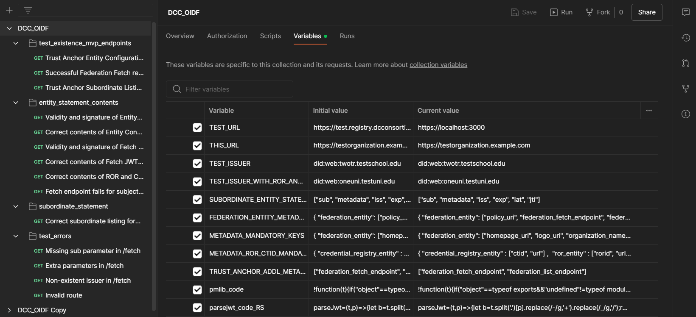

# dcc-members-oidf


## Description:

A pilot implementation of an issuer identity registry for identifying the issuers of learning and employment credentials, using a version of the [OpenID Federation](https://openid.net/specs/openid-federation-1_0.html) specification.

NOTE that this implementation doesn't explicitly follow the OIDF specification as-is, but rather explores how the specification could be modified to support [DIDs (Decentralized Identifiers)](https://www.w3.org/TR/did-1.1/)

This implementation implements three endpoints from the OIDF specification:

#### GET /.well-known/openid-federation
Returns metadata about the registry, encoded as a JWT, which decoded looks like so:

```json
{
  "sub": "https://test.registry.dcconsortium.org",
  "metadata": {
    "federation_entity": {
      "organization_name": "Digital Credentials Consortium (TEST)",
      "homepage_uri": "https://digitalcredentials.mit.edu",
      "logo_uri": "",
      "policy_uri": "https://digitalcredentials.mit.edu/dcc-members-registry-governance",
      "federation_fetch_endpoint": "https://test.registry.dcconsortium.org/fetch",
      "federation_list_endpoint": "https://test.registry.dcconsortium.org/subordinate_listing"
    },
    "institution_additional_information": {
      "legal_name": "Digital Credentials Consortium"
    }
  },
  "iss": "https://test.registry.dcconsortium.org",
  "exp": 1753460570,
  "iat": 1753374170,
  "jti": "59bok55gjp",
  "jwks": {
    "keys": [
      {
        "kty": "EC",
        "crv": "P-256",
        "kid": "issuerregistry-key1",
        "x": "Rz1NHMJ_tAZQXsJOYqnYruGYimG6WNOp0N234E7wqOs",
        "y": "J5iCLb2T_ysCHpjFzcR3iW-tuDuXEHnJPvfVMQZOfzY"
      }
    ]
  }
}
```
#### GET /fetch?sub={DID}
Returns metadata about the provided value of the 'sub' parameter, which must be a DID. The result is also encoded as JWT, which decoded looks something like so:

```json
{
  "sub": "did:web:oneuni.testuni.edu",
  "metadata": {
    "federation_entity": {
      "organization_name": "OneUni University",
      "homepage_uri": "https://oneuni.edu",
      "logo_uri": ""
    },
    "institution_additional_information": {
      "legal_name": "Board and Trustees of OneUni University"
    },
    "credential_registry_entity": {
      "ctid": "ce-e8a41a52-6ff6-48f0-9872-889c87b093b7",
      "url": "https://credentialengineregistry.org/resources/ce-e8a41a52-6ff6-48f0-9872-889c87b093b7"
    },
    "ror_entity": {
      "rorid": "042nb2s44",
      "url": "https://ror.org/042nb2s44"
    }
  },
  "iss": "https://test.registry.dcconsortium.org",
  "exp": 1753460732,
  "iat": 1753374332,
  "jti": "gk63tfctvgg"
}
```
#### GET /subordinate_listing
Returns a listing of all DIDs in the registry as a plain json list (not encoded as a JWT):

```json
[
    "did:key:z6Mki7DqKQswPsjqMVhP4W3n2ABFb5wBegZC5erEVg5qcgEw",
    "did:web:digitalcredentials.github.io:vc-test-fixtures:dids:oidf",
    "did:web:twotr.testschool.edu",
    "did:key:z6MkjoriXdbyWD25YXTed114F8hdJrLXQ567xxPHAUKxpKkS",
    "did:web:digitalcredentials.github.io:dcc-did-web:issuer-registry-client-test",
    "did:key:z6MkhaXgBZDvotDkL5257faiztiGiC2QtKLGpbnnEGta2doK",
    "did:web:oneuni.testuni.edu",
    "did:key:z6MkwAXDaf8K2uw4sxYemy6qrBawSyGR4jZAGfUphxLbWw4n",
    "did:key:z6MkuL7x2mTEoBmUuuaQ2hvEUd2YsEtmsHeX9JzqJZ8VYaVH"
]
```

The rest of this README describes:

- how the DCC instance of this registry was set up on AWS as an AWS lambda function, and so how someone might set up their own instance that way
- how a new developer can set up their local development environment to contribute code and deploy it to the running DCC instance

## Install/Setup

This describes how the DCC installation of this registry was set up on AWS using terraform for provisioning, which in turn uses
the AWS CLI to provision:

* the AWS lambda function
* the s3 bucket and s3 object for the lambda zip file
* cloudwatch
* cloudfront
* the api gateway.

Note that there are also dynamo db tables, which were intially setup with terraform, but subsequently removed from the terraform configuation to remove any chance of terraform overwriting values in the db. We describe further below how to set them up manually on AWS.

Similarly, the terraform state file had been local, but is now remote ("backend") and hosted in an s3 bucket, to make it easier to share terraform state between developers. The s3 bucket is not provisioned by terraform, again to avoid any chance of terraform overwriting it, so you'll have to create it yourself. We discuss the remote and local options further below.

Backups of the dynamo tables were also added in an additional s3 bucket, which again was not provisioned by terraform to avoid possible terraform overwrites.

Next up we'll cover:

* Installing the AWS CLI
* Installing Terraform
* Cloning this repository
* Initializing Terraform locally
* Setting up your Databases
* Invoking Terraform to provision Lambda and its S3 bucket, Cloudfront, Cloudwatch, and the API Gateway

### Install AWS CLI

The AWS CLI (command line interface) lets us issue commands to AWS directly from a terrminal. We can use the CLI to create databases, S3 buckets, and so on. In particular, Terraform uses it for provisioning.

Setting up the AWS CLI is simple enough - follow the AWS instructions to install:

[https://docs.aws.amazon.com/cli/latest/userguide/getting-started-install.html](https://docs.aws.amazon.com/cli/latest/userguide/getting-started-install.html)

You'll also need AWS credentials, which the CLI uses when making calls to AWS.

To set up our pilot we used this method, which isn't the most secure method, but appropriate for our proof of concept.

[https://docs.aws.amazon.com/cli/latest/userguide/cli-authentication-user.html](https://docs.aws.amazon.com/cli/latest/userguide/cli-authentication-user.html)

WARNING: in a full production deployment, you should instead use the IAM Identity Center approach:

[https://docs.aws.amazon.com/singlesignon/latest/userguide/what-is.html](https://docs.aws.amazon.com/singlesignon/latest/userguide/what-is.html)

### Install Terraform

[https://developer.hashicorp.com/terraform/tutorials/aws-get-started/install-cli](https://developer.hashicorp.com/terraform/tutorials/aws-get-started/install-cli)

### Clone and initialize this repository

git clone git@github.com:digitalcredentials/dcc-members-oidf.git

or however you like to clone

Then:

`npm i`

and **IMPORTANTLY** YOU MUST ALSO RUN `npm i` IN THE 'lambda_function' directory to get the npm packages installed there, BEFORE
you try to deploy a new verson of the lambda to AWS.

### Initialize terraform

The terraform configuration in this repository uses the terraform 'backend' to store the current state
of the DCC terraform deployment in an S3 bucket, so it can be shared by all developers.

You can do the same by creating an S3 bucket and 
setting the 'backend' property in [main.tf](./main.tf) to point to your new S3 bucket.

Alternatively, you can remove the backend property from main.tf and terraform will track your state locally.

When you've first checked out the repository, run `terraform init`. Terraform will set up its modules, and read and/or save to
the 'backend' if you've opted to store state remotely, or track state locally if not.

As a test that things are as they should be, running `terraform plan` should indicate that about 45 new components are ready to deploy on AWS.

### Setup a new registry

Do this only if you are setting up a brand new registry. It will provision new AWS services as specified in the *.tf terraform files.

If you've already got a registry and are simply getting setup locally to make changes to it then jump to the next section

#### Invoke Terraform to provision new services

Run `terraform apply`

**Be careful not to do this if you have a currently active AWS instance,** because it can destroy your currently active AWS instance and/or deploy a second copy. NOTE: this is an older warning that may no longer be valid as we've moved the db creation and S3 creation out
of terraform, but we leave the warning here to be on the safe side.

#### Set up your DNS records

Using `terraform output`, add to your DNS records:
- First: certificate_validation_cname and subdomain_validation_cname
- Next: api_gateway_cname

General note about deployment:
- For the first deployment of the cloudwatch distributions, the deployment might fail on the first time, then it might actually be deployed and the import will need to happen manually (`terraform import`)

#### Create your dynamo db tables

As mentioned above, we initially used terraform to provision the tables, but as advised in the terraform/aws documentation, we removed
those commands because they could accidentally overwrite the running db tables.

So you'll instead have to setup your tables manually, as described in the AWS documentation:

https://docs.aws.amazon.com/amazondynamodb/latest/developerguide/getting-started-step-1.html

You'll need four tables if you are using the code in this repo as-is. Two for the issuers:

dcc-oidf-p-db-issuers
dcc-oidf-t-db-issuers

As you might guess, one is for production and one for test. Both need a partition key called 'sub_name' of type String.

And two for the keys:

dcc-oidf-p-db-registry-public-keys
dcc-oidf-t-db-registry-public-keys

Again, one for production and one for test. Both need a partition key called key_id of type String.

##### Sample data

All values are strings (TEXT). See `./schema.sql` for the columns which are used in each table (issuers and registry info) and `./testdata.sql` for sample data. If you need to fill a database from scratch, you can use all of the values from `aws dynamodb batch-write-item --request-items file://testdata.json` or fill them by hand by reading them off from `./schema.sql`.

### Updating code on an existing registry instance:

After you've made changes to the code - likely to [./lambda_function/issuer_registry.mjs](./lambda_function/issuer_registry.mjs) you can then deploy a new version of the lambda funtion.

There are two lambda instances running, one test and one production, and so you'll typically want to first deploy to the test instance.

But first confirm your account has access to the currently deployed instances, and specifically the lambda function with:

 `aws lambda get-function --function-name dcc-oidf-t-issuer-registry --region us-east-1` 
 
 which will try to get a status of the 'test' lambda deployment, i.e, dcc-oidf-t-issuer-registry

When deploying to production confirm access with:

 `aws lambda get-function --function-name dcc-oidf-p-issuer-registry --region us-east-1` 

Then run:

`terraform plan`

You should have 2 or 4 components ready to redeploy (code zips and potentially lambda functions).

Push new code to test only: 

`terraform apply "-target=module.test"`

Push new code to prod only: 

`terraform apply "-target=module.production"`

(Rarely used): push new SSL certs: 

`terraform apply "-target=module.certificates"` 

(Do not use unless you want to update test and prod simultaneously): 

`terraform apply "-target=module.certificates"`

### Testing locally (using SQLite):

`npm run builddb`, 
`npm run localtestdata`
`npm run webservice`

NOTE: You may need to generate local server cert (HTTPS): `npm run keygen`

NOTE: when running 'webservice' on a Mac, you may get errors about the sqlite3 binaries, which I was able to fix on my Mac with 'brew install python-setuptools' which is apparently not installed by default on a mac (i.e, pyton-setuptools) but seemingly is on windows.

You can test the endpoints manually:

* `curl https://localhost:3000/.well-known/openid-federation`
* `curl 'https://localhost:3000/subordinate_listing'`
* `curl 'https://localhost:3000/fetch?sub=did%3Aweb%3Aoneuni.testuni.edu'`

### Running Postman tests

Tests are run via `tests/DCC_OIDF.postman_collection.json`. The Current value of TEST_URL can be changed to test alternatively `https://localhost:3000` (local) or `https://test.registry.dcconsortium.org` (AWS Test) if you want to test both options. Use the Import and right-click > Export functionality in Postman to load and export new tests. 



## Ancillary scripts:

- Generate a sample set of ECDSA private and public keys: `./scripts/generate_ecdsa_keys.sh`
- Check to see if a sample set of ECDSA private and public keys are valid: `python3 ./test.py privatekey x y`


## Other tools used:

- https://emn178.github.io/online-tools/ecdsa/key-generator/ to generate and test EC P-256 keys informally
- https://jwt.io/ to inspect JWTs

